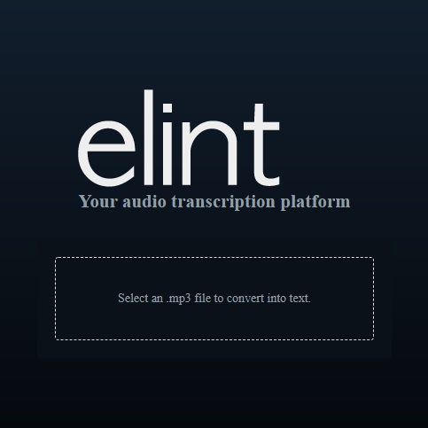

# WebApp: Audio Transcriptor

A aplicação,dada como desafio pela empresa Elint, permite que o usuário realize o upload de arquivos .mp3 para a api disponibilizada pela empresa e obtenha com retorno um arquivo json pronto para download.

### Objetivo da aplicação

Facilitar o processo de transcrição de áudios com um site simples e fácil de ser utilizado.

### Como executar a aplicação

Depois de baixar/clonar o repositório, entre no diretório principal e digite

`npm install`

para instalar os pacotes JavaScript utilizados pela aplicação, logo após digite

`npm start`

A partir de então a aplicação estará disponível em [http://localhost:3000](http://localhost:3000)

### Em produção

Depois que o código da aplicação está pronto é preciso gerar as versões otimizadas dos arquivos. Para gerar a versão em produção dessa aplicação, no diretório principal digite

`npm run build`

#### Executando a aplicação em produção

Para executar a aplicação em modo produção entre no diretório principal e digite

`node build/app.js`
